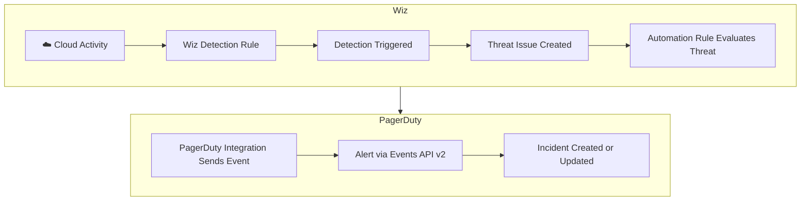

# Wiz → PagerDuty Threat Detection Integration 

This repository contains the event payload template for routing [Wiz Threat Detection](https://docs.wiz.io/docs/coverage) Threats into PagerDuty via Wiz Automation Rules.
 
> **License requirement:** Wiz Defend is required for Threats and Detections.



 
---

## Prerequisites
 
- Wiz tenant with the **Wiz Defend** license
- PagerDuty account with a service configured to receive events
- A PagerDuty **Events API v2** integration key (routing key)
---
 
## Setup
 
### 1. Create a PagerDuty Integration
 
1. In PagerDuty, navigate to **Services** → select or create a service.
2. Go to the **Integrations** tab → **Add Integration**.
3. Select **Events API v2**.
4. Copy the **Integration Key** (routing key) — you'll need this in the next step.
### 2. Configure the Wiz Integration
 
1. In Wiz, navigate to **Settings** → **Integrations** → **Add Integration**.
2. Select **PagerDuty** and provide:
   - A name for the integration
   - Your PagerDuty **routing key**
3. Save the integration.
### 3. Create an Automation Rule
 
1. In Wiz, navigate to **Policies** → **Automation Rules** → **New Rule**.
2. Set the trigger to **Threat** and configure your desired filters (severity, cloud platform, project, etc.).
3. Set the action to **PagerDuty - Create Incident**.
4. Paste the payload template below into the request body.
5. Save and enable the rule.
---
 
## Payload Template
 
```json
{
  "summary": "[{{#issue.enrichedCloudAccounts}}{{name}}{{/issue.enrichedCloudAccounts}}{{^issue.enrichedCloudAccounts}}N/A{{/issue.enrichedCloudAccounts}}] [{{issue.enrichedMainDetection.rule.name}}] [{{issue.entitySnapshot.type}}]{{#issue.enrichedThreatActors}} by [{{name}}]{{/issue.enrichedThreatActors}}",
  "severity": "info",
  "source": "wiz",
  "custom_details": {
    "runbook": "https://google.com",
    "trigger": {
      "source": "{{triggerSource}}{{^triggerSource}}N/A{{/triggerSource}}",
      "type": "{{triggerType}}{{^triggerType}}N/A{{/triggerType}}",
      "ruleId": "{{ruleId}}{{^ruleId}}N/A{{/ruleId}}",
      "ruleName": "{{ruleName}}{{^ruleName}}N/A{{/ruleName}}",
      "updatedFields": "{{#changedFields}}{{name}} field was changed from {{previousValuePrettified}} to {{newValuePrettified}} {{/changedFields}}{{^changedFields}}N/A{{/changedFields}}",
      "changedBy": "{{changedBy}}{{^changedBy}}N/A{{/changedBy}}"
    },
    "threat": {
      "id": "{{issue.id}}{{^issue.id}}N/A{{/issue.id}}",
      "title": "{{issue.enrichedMainDetection.rule.name}}{{^issue.enrichedMainDetection.rule.name}}N/A{{/issue.enrichedMainDetection.rule.name}}",
      "description": "{{issue.enrichedMainDetection.description}}{{^issue.enrichedMainDetection.description}}N/A{{/issue.enrichedMainDetection.description}}",
      "status": "{{issue.status}}{{^issue.status}}N/A{{/issue.status}}",
      "severity": "{{issue.severity}}{{^issue.severity}}N/A{{/issue.severity}}",
      "created": "{{issue.createdAt}}{{^issue.createdAt}}N/A{{/issue.createdAt}}",
      "resolutionNote": "{{issue.resolutionNote}}{{^issue.resolutionNote}}N/A{{/issue.resolutionNote}}",
      "cloudAccounts": "{{#issue.enrichedCloudAccounts}}{{name}}, {{/issue.enrichedCloudAccounts}}{{^issue.enrichedCloudAccounts}}N/A{{/issue.enrichedCloudAccounts}}",
      "actors": "{{#issue.enrichedThreatActors}}{{name}}, {{/issue.enrichedThreatActors}}{{^issue.enrichedThreatActors}}N/A{{/issue.enrichedThreatActors}}",
      "resources": "{{#issue.enrichedThreatResources}}{{name}} ({{nativeType}}), {{/issue.enrichedThreatResources}}{{^issue.enrichedThreatResources}}N/A{{/issue.enrichedThreatResources}}",
      "resourceType": "{{issue.entitySnapshot.type}}{{^issue.entitySnapshot.type}}N/A{{/issue.entitySnapshot.type}}",
      "projects": "{{#issue.projects}}{{name}}, {{/issue.projects}}{{^issue.projects}}N/A{{/issue.projects}}",
      "threatURL": "https://{{wizDomain}}/threats#~(issue~'{{issue.id}})",
      "resolvedAt": "{{issue.resolvedAt}}{{^issue.resolvedAt}}N/A{{/issue.resolvedAt}}",
      "updatedAt": "{{issue.updatedAt}}{{^issue.updatedAt}}N/A{{/issue.updatedAt}}",
      "cloudPlatform": "{{issue.entitySnapshot.cloudPlatform}}{{^issue.entitySnapshot.cloudPlatform}}N/A{{/issue.entitySnapshot.cloudPlatform}}",
      "tdrSources": "{{#issue.enrichedDetections}}{{rule.name}}, {{/issue.enrichedDetections}}{{^issue.enrichedDetections}}N/A{{/issue.enrichedDetections}}",
      "detectionIds": "{{#issue.enrichedDetections}}{{id}}, {{/issue.enrichedDetections}}{{^issue.enrichedDetections}}N/A{{/issue.enrichedDetections}}",
      "notes": "{{#issue.notes}}{{user.email}}-{{text}}, {{/issue.notes}}{{^issue.notes}}N/A{{/issue.notes}}"
    }
  }
}
```
 
### Summary Format
 
The incident summary renders as:
 
```
[<cloud account>] [<detection rule name>] [<resource type>] by [<actor>]
```
 
Example:
```
[pagerduty-production] [Anomalous modification of sudoers file] [VIRTUAL_MACHINE] by [someone@pagerduty.com]
```
 
The `by [<actor>]` segment is omitted when no threat actor is identified.
 
---
 
## Template Variables Reference
 
| Field | Description |
|---|---|
| `issue.enrichedCloudAccounts` | Cloud accounts associated with the threat |
| `issue.enrichedMainDetection.rule.name` | Name of the primary detection rule |
| `issue.entitySnapshot.type` | Resource type of the primary affected entity |
| `issue.enrichedThreatActors` | Actors (users/principals) involved in the threat |
| `issue.enrichedThreatResources` | Resources involved in the threat |
| `issue.entitySnapshot.cloudPlatform` | Cloud provider (AWS, GCP, Azure, etc.) |
| `issue.enrichedDetections` | All detections associated with the threat |
| `triggerSource` / `triggerType` | What triggered the automation rule |
| `changedFields` | Fields that changed on a status update trigger |
 
Full variable reference: [Wiz Automation Rule Template Variables](https://docs.wiz.io/docs/how-actions-and-automation-rules-work#threats)
 
---
 
## Notes
 
- Template variables use [Mustache](https://mustache.github.io/) syntax. Block sections (`{{#field}}...{{/field}}`) iterate arrays; inverted sections (`{{^field}}...{{/field}}`) render when a field is empty.
- Fields that may be empty (actors, notes, resolution note, etc.) fall back to `N/A`.

## FAQ

1. How can I send Detection payloads to PagerDuty?
- Wiz recommends using Threats instead of Detections for enriched alerting generally, but sometimes there are cases where you also want to receive Detections. To set up Detection alerting to PagerDuty, you'll need to use a Webhook as PD is currently not a supported destination. Here's an example basic Detection payload:

```
{
  "payload": {
    "custom_details": [
      {
        "detection": {
          "triggerSource": "{{triggerSource}}",
          "triggerType": "{{triggerType}}",
          "ruleId": "{{ruleld}}",
          "ruleName": "{{ruleName}}",
          "id": "{{detection.id}}",
          "issue_id": "{{detection.issue.id}}",
          "url": "{{detection.issue.url}}",
          "name": "{{detection.rule.name}}",
          "detectionId": "{{detection.rule.id}}",
          "sourceType": "{{detection.rule.sourceType}}",
          "detectionDescription": "{{detection.description}}",
          "severity": "{{detection.severity}}",
          "createdAt": "{{detection.createdAt}}"
        }
      }
    ],
    "summary": "{{detection.rule.name}}",
    "severity": "critical",
    "source": "wiz"
  },
  "routing_key": "replace-me",
  "event_action": "trigger"
}
```
2. How can I dedupe Detections and Threats?
- You can enable Alert Grouping by time window as one option to combine alerts into incidents if you want to receive both Threats and Detections. Threats generally arrive within 5-10 mins of a Detection alert.
